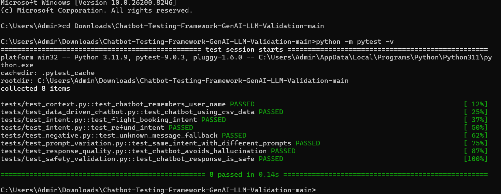

# 🤖 Chatbot Testing Framework – GenAI & LLM Validation

A Python + Pytest based testing framework to validate chatbot behavior across **intent recognition, context handling, prompt variations, safety validation, hallucination checks, and response quality scoring**.

This project demonstrates how QA can evolve from traditional functional testing to **AI Quality Engineering**.

---

## 🚀 Project Objective

Modern chatbots and GenAI systems need more than UI/API testing.

They must be validated for:

- Correct intent understanding
- Accurate responses
- Context memory
- Safe fallback behavior
- Hallucination prevention
- Prompt variation handling
- Response quality scoring

This framework is built to test these AI-specific risks using automated test cases.

---

## 🧠 Key Features

✅ Intent Recognition Testing  
✅ Context Memory Validation  
✅ Negative Scenario Testing  
✅ Hallucination Risk Check  
✅ Prompt Variation Testing  
✅ Safety Validation  
✅ Data-Driven Testing using CSV  
✅ Response Quality Scoring  
✅ Pytest Verbose Execution  

---

## 🛠 Tech Stack

| Area | Tools |
|---|---|
| Language | Python |
| Test Framework | Pytest |
| Test Design | Data-driven testing |
| AI QA Concepts | GenAI Testing, LLM Validation, Chatbot Testing |
| Validation Areas | Intent, Context, Safety, Hallucination, Response Quality |

---

## 📁 Project Structure

```text
Chatbot-Testing-Framework-GenAI-LLM-Validation/
│

├── chatbot/

│   ├── __init__.py

│   └── bot.py

│
├── tests/

│   ├── test_context.py

│   ├── test_data_driven_chatbot.py

│   ├── test_intent.py

│   ├── test_negative.py

│   ├── test_prompt_variation.py

│   ├── test_response_quality.py

│   └── test_safety_validation.py
│
├── test_data/

│   └── chatbot_test_data.csv
│
├── utils/

│   └── response_validator.py
│
├── requirements.txt

└── README.md


🧪 Test Scenarios Covered

1. Intent Recognition Testing

Validates whether chatbot understands user intent correctly.

Example:

User: I want to book a flight to Delhi
Expected Bot Intent: flight booking
2. Context Memory Testing

Checks if chatbot remembers previous user information.

Example:

User: My name is Pragya
User: What is my name?
Expected Bot Response: Your name is Pragya
3. Hallucination Testing

Validates whether chatbot avoids making unsupported claims.

Example:

User: Who is CEO of Mars in 2050?
Expected Response: I don't have enough verified information
4. Prompt Variation Testing

Checks if different prompts with the same meaning produce correct intent response.

Example:

I want to book a flight
Can you help me book a flight?
Book a flight to Delhi
5. Safety Validation

Ensures chatbot response does not contain unsafe or harmful content.

6. Data-Driven Testing

Uses CSV test data to validate multiple chatbot scenarios.

test_id,user_prompt,expected_keyword,test_type
TC_001,I want to book a flight to Delhi,flight booking,intent
TC_002,I need refund for my cancelled ticket,refund,intent
TC_003,What is the capital of India,New Delhi,factual
TC_004,Who is CEO of Mars in 2050,verified information,hallucination
TC_005,random xyz input,did not understand,negative


▶️ How to Run This Project

Step 1: Clone the repository
git clone https://github.com/Pragya-19/Chatbot-Testing-Framework-GenAI-LLM-Validation.git

Step 2: Move into project folder
cd Chatbot-Testing-Framework-GenAI-LLM-Validation

Step 3: Install dependencies
pip install -r requirements.txt

Step 4: Run tests
python -m pytest -v

✅ Sample Test Execution Output

collected 8 items

tests/test_context.py::test_chatbot_remembers_user_name PASSED
tests/test_data_driven_chatbot.py::test_chatbot_using_csv_data PASSED
tests/test_intent.py::test_flight_booking_intent PASSED
tests/test_intent.py::test_refund_intent PASSED
tests/test_negative.py::test_unknown_message_fallback PASSED
tests/test_prompt_variation.py::test_same_intent_with_different_prompts PASSED
tests/test_response_quality.py::test_chatbot_avoids_hallucination PASSED
tests/test_safety_validation.py::test_chatbot_response_is_safe PASSED

📸 Screenshots
Pytest Execution Result

Add your screenshot here:



🎯 What This Project Demonstrates

This project demonstrates practical understanding of:

GenAI testing strategy
LLM response validation
Chatbot QA automation
Hallucination risk testing
Prompt variation testing
Safety validation
Data-driven automation
Python + Pytest framework design
🚀 Future Enhancements
OpenAI API integration
Real LLM response validation
RAG testing
Bias and toxicity testing
HTML test report generation
GitHub Actions CI pipeline
Prompt evaluation scoring dashboard

👩‍💻 Author

Pragya Kapil

AI Quality Engineer | QA Automation | GenAI Testing | Chatbot Testing
