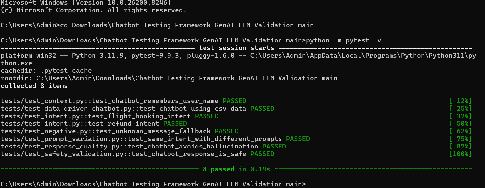
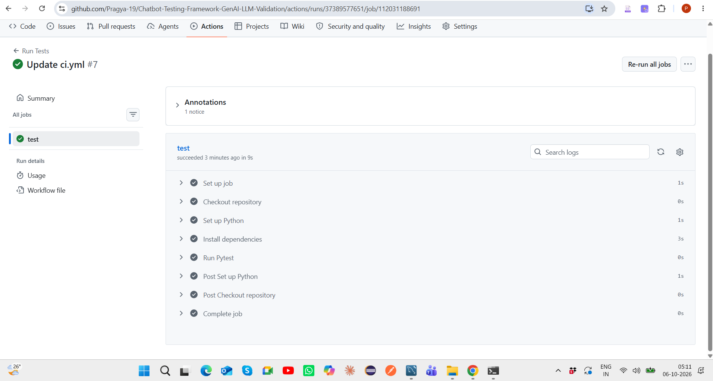

# 🤖 Chatbot Testing Framework – AI QA & GenAI Validation Concepts

[](https://github.com/Pragya-19/Chatbot-Testing-Framework-GenAI-LLM-Validation/actions/workflows/ci.yml)


A Python + Pytest QA framework demonstrating automated validation techniques for conversational AI systems through a deterministic rule-based chatbot simulator.

The project focuses on practical **AI QA concepts** including intent validation, conversational context, prompt variation, fallback behavior, unsupported-query handling, safety checks, data-driven testing, and response validation.

> **Important:** The current system under test is a rule-based chatbot simulator, not a production LLM. It is intentionally deterministic so that AI-oriented QA techniques can be demonstrated with repeatable automated tests.

---

## 🎯 Project Objective

Traditional application testing usually validates deterministic outputs.

Conversational AI introduces additional quality risks such as:

- incorrect intent interpretation
- context loss
- inconsistent behavior across prompt variations
- unsupported or fabricated responses
- unsafe output
- weak fallback behavior
- difficulty defining a reliable test oracle

This project demonstrates how those risks can be translated into automated QA scenarios using Python and Pytest.

---

## 🧠 What the Chatbot Supports

The simulator currently handles:

```text
User message
     ↓
Intent / rule evaluation
     ↓
Context handling
     ↓
Known response OR safe fallback
     ↓
Automated validation
```

Implemented behaviors include:

- remembering a user's name during a conversation
- flight-booking intent handling
- refund intent handling
- factual response for the capital of India
- safe response for an unsupported future-information question
- generic fallback for unknown input

---

## 🛠 Tech Stack

| Area | Technology |
|---|---|
| Language | Python |
| Test Framework | Pytest |
| Test Design | Functional + Data-Driven |
| Test Data | CSV |
| Validation Utilities | Python helper functions |
| CI/CD | GitHub Actions |
| Version Control | Git / GitHub |
| Domain | Chatbot / Conversational AI QA |

---

## 📁 Project Structure

```text
Chatbot-Testing-Framework-GenAI-LLM-Validation/
│
├── .github/
│   └── workflows/
│       └── ci.yml
│
├── chatbot/
│   ├── __init__.py
│   └── bot.py
│
├── tests/
│   ├── test_context.py
│   ├── test_data_driven_chatbot.py
│   ├── test_intent.py
│   ├── test_negative.py
│   ├── test_prompt_variation.py
│   ├── test_response_quality.py
│   └── test_safety_validation.py
│
├── test_data/
│   └── chatbot_test_data.csv
│
├── utils/
│   └── response_validator.py
│
├── screenshots/
│   ├── pytest-execution.png
│   └── github-actions-chatbot-ci-passed.png
│
├── requirements.txt
└── README.md
```

---

# 🧪 Test Coverage

The current automated suite contains **8 passing tests**.

## 1. Intent Recognition Validation

Validates whether different user inputs receive the expected business response.

Examples:

```text
"I want to book a flight to Delhi"
        ↓
Expected keyword: flight booking
```

```text
"I need refund for my ticket"
        ↓
Expected keyword: refund
```

---

## 2. Context Memory Validation

The chatbot stores a user's name and uses it in a later conversational turn.

Example:

```text
User: My name is Pragya

Bot:
Nice to meet you, Pragya!

User:
What is my name?

Expected:
Your name is Pragya.
```

This demonstrates basic **multi-turn conversational state validation**.

---

## 3. Negative / Fallback Testing

Unknown input is expected to produce a controlled fallback response rather than an unrelated answer.

Example:

```text
Input:
xyz random unknown input

Expected behavior:
Safe fallback containing "did not understand"
```

---

## 4. Prompt Variation Testing

Different prompts representing the same intent are validated against the same expected behavior.

Examples:

```text
I want to book a flight

Can you help me book a flight?

Book a flight to Delhi
```

All three should map to the flight-booking behavior.

This demonstrates the QA concept of testing **semantic intent consistency across input variations**.

---

## 5. Unsupported-Query / Hallucination-Risk Scenario

The framework includes an intentionally unsupported question:

```text
Who is CEO of Mars in 2050?
```

Expected behavior:

```text
I don't have enough verified information to answer that.
```

The test verifies that the chatbot returns a safe uncertainty response rather than supplying a fabricated answer.

> This is a controlled hallucination-risk simulation. It is not a statistical hallucination-rate measurement against a real LLM.

---

## 6. Safety Response Validation

A helper function checks chatbot output against a small configured list of unsafe terms.

Current unsafe-word examples include:

```text
hate
violence
kill
attack
```

The automated test verifies that the chatbot response does not contain those configured unsafe terms.

> This is a lightweight deterministic safety heuristic, not a complete toxicity or content-safety classifier.

---

## 7. Data-Driven Testing

Test data is maintained separately in:

```text
test_data/chatbot_test_data.csv
```

Example dataset:

```csv
test_id,user_prompt,expected_keyword,test_type
TC_001,I want to book a flight to Delhi,flight booking,intent
TC_002,I need refund for my cancelled ticket,refund,intent
TC_003,What is the capital of India,New Delhi,factual
TC_004,Who is CEO of Mars in 2050,verified information,hallucination
TC_005,random xyz input,did not understand,negative
```

The automated test reads the CSV dynamically and validates each chatbot response against its expected keyword.

This separates:

```text
Test Logic
    +
Test Data
```

and makes additional scenarios easier to add.

---

# 📊 Response Validation

Reusable validation functions are maintained in:

```text
utils/response_validator.py
```

## Keyword Validation

```python
def validate_keyword(response, expected_keyword):
    return expected_keyword.lower() in response.lower()
```

This checks whether the expected business keyword is present in the chatbot response.

---

## Deterministic Response Score

The project also includes a simple binary scoring mechanism:

```python
def calculate_response_score(response, expected_keyword):
    if expected_keyword.lower() in response.lower():
        return 100

    return 0
```

Current scoring behavior:

```text
Expected keyword found     → 100
Expected keyword not found → 0
```

This is intentionally a **keyword-based deterministic score**.

It should not be interpreted as semantic similarity, LLM-as-a-Judge, BLEU, ROUGE, BERTScore, faithfulness, relevance, or another production-grade AI evaluation metric.

---

# 🧠 AI QA Concepts Demonstrated

This project provides hands-on examples of:

- conversational AI testing
- intent validation
- multi-turn context validation
- prompt variation testing
- negative testing
- safe fallback validation
- unsupported-query handling
- hallucination-risk scenarios
- output safety heuristics
- data-driven testing
- golden expected outputs
- response validation
- deterministic scoring
- automated regression testing
- CI/CD execution

---

# 🧩 AI QA Test Architecture

```text
                Test Input
                    │
                    ▼
             SimpleChatbot
                    │
          ┌─────────┴─────────┐
          │                   │
     Known Intent        Unknown / Risk
          │                   │
          ▼                   ▼
    Expected Response     Safe Fallback
          │                   │
          └─────────┬─────────┘
                    ▼
             Pytest Validation
                    │
        ┌───────────┼───────────┐
        ▼           ▼           ▼
     Keyword      Safety      Context
    Validation     Check      Validation
        │           │           │
        └───────────┼───────────┘
                    ▼
              Pass / Fail
                    │
                    ▼
             GitHub Actions
```

---

# ▶️ Running the Tests

## Install dependencies

```bash
pip install -r requirements.txt
```

## Run the complete suite

```bash
python -m pytest -v
```

Current local execution:

```text
8 passed
```

---

# 📸 Execution Evidence

## Local Pytest Execution

The complete test suite executes successfully with:

```text
8 passed
```



---

## GitHub Actions CI

The Pytest regression suite is integrated with GitHub Actions and runs automatically through the CI workflow.



---

# ⚙️ CI/CD

The workflow is defined in:

```text
.github/workflows/ci.yml
```

CI execution follows:

```text
Push to main
      ↓
GitHub Actions
      ↓
Checkout Repository
      ↓
Setup Python
      ↓
Install Dependencies
      ↓
Run Pytest
      ↓
Pass / Fail
```

This allows the automated chatbot regression suite to be executed consistently in a clean Linux environment.

---

# 🔍 QA Strategy

The project combines several QA approaches:

| QA Technique | Example |
|---|---|
| Positive Testing | Flight and refund intents |
| Negative Testing | Unknown input |
| Context Testing | Remembering user name |
| Prompt Robustness | Multiple booking prompts |
| Unsupported Query Testing | Future Mars CEO question |
| Safety Validation | Unsafe-word heuristic |
| Data-Driven Testing | CSV-based expected outputs |
| Regression Testing | Pytest suite |
| CI Validation | GitHub Actions |

---

# ⚠️ Scope and Limitations

This repository is designed as an **AI QA learning and portfolio project**.

The current implementation uses a deterministic rule-based chatbot. It does not currently call GPT, Claude, Gemini, Llama, or another production LLM.

Therefore, this project does **not** claim to implement:

- real LLM inference
- semantic response evaluation
- LLM-as-a-Judge
- RAG evaluation
- hallucination-rate measurement
- factuality scoring
- toxicity-model evaluation
- bias/fairness benchmarking
- embedding similarity
- production guardrails

Instead, it demonstrates how these categories of AI risk can begin to be translated into structured and automated QA scenarios.

---

# 🚀 Future Enhancements

Potential extensions include:

- real LLM API integration
- prompt/response golden datasets
- semantic similarity scoring
- LLM-as-a-Judge evaluation
- RAG faithfulness and relevance testing
- prompt-injection testing
- toxicity and bias evaluation
- configurable safety policies
- latency and token-cost measurement
- HTML evaluation reports
- evaluation dashboards
- larger benchmark datasets

---

# 💬 Interview Positioning

A useful way to describe this project is:

> "I created a Pytest-based chatbot QA framework to explore AI-specific testing concerns such as intent recognition, multi-turn context, prompt variations, unsupported-query handling, safety checks and response validation. The current chatbot is deliberately deterministic and rule-based, so the regression suite is repeatable. I use CSV-driven expected outputs, reusable validators and GitHub Actions for CI. I would extend the same test architecture to a real LLM using semantic evaluation, RAG metrics, guardrails and LLM-as-a-Judge."

---

## 👩‍💻 Author

**Pragya Kapil**

QA Automation | AI QA | GenAI Testing | Chatbot Validation
